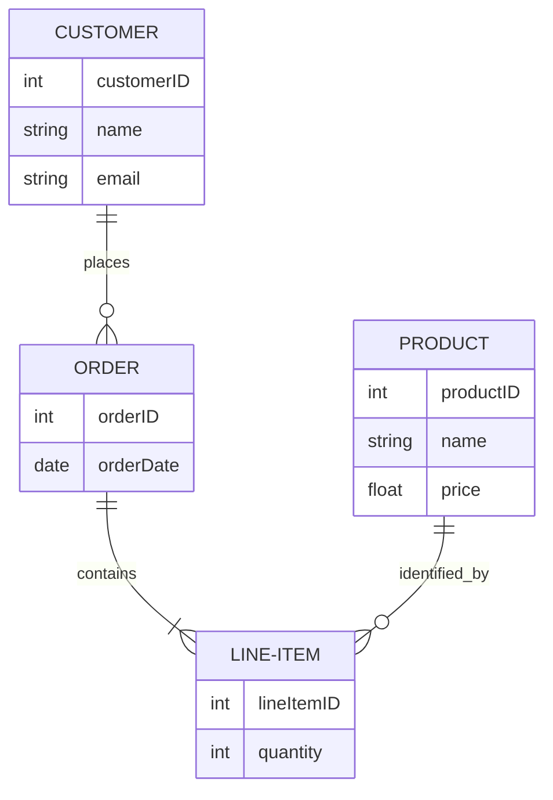
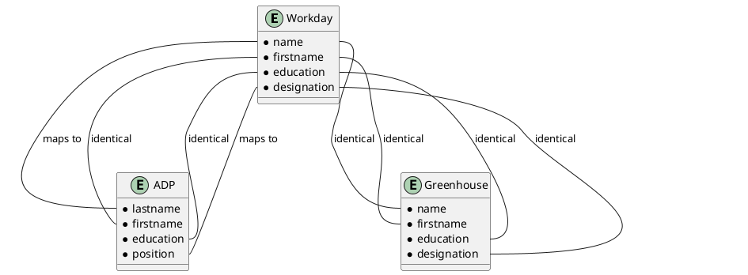
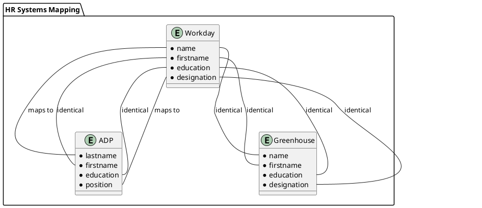
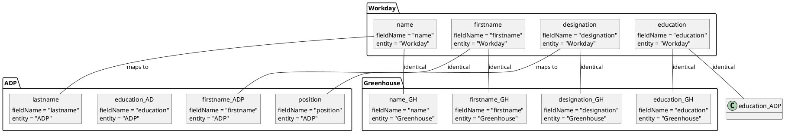
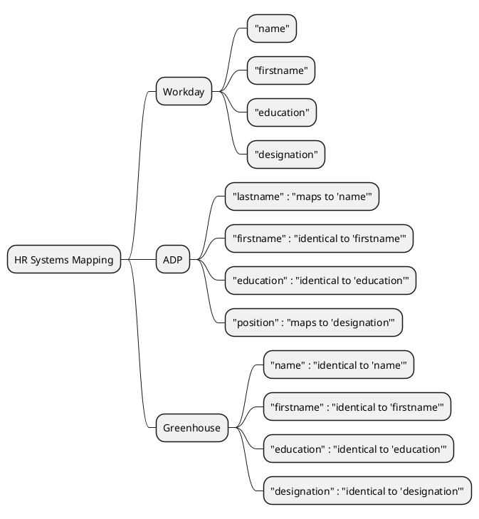
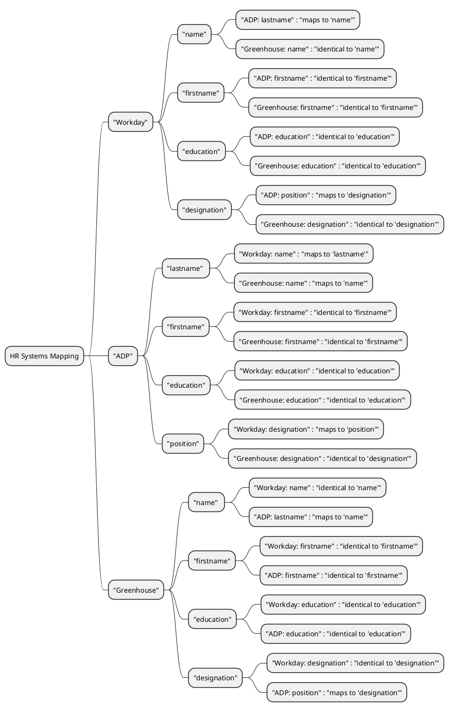
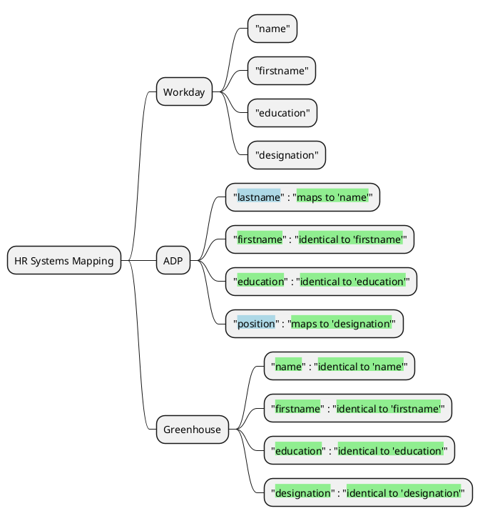
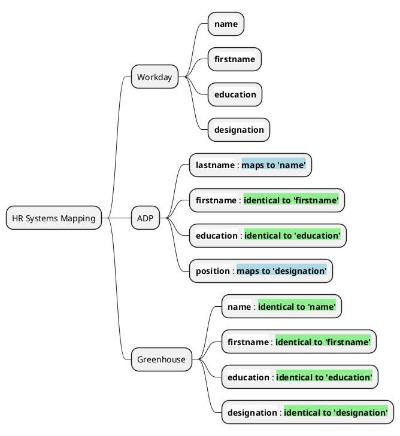

Trying to figure out a way to represent below into a mapping

| Workday     | ADP       | Greenhouse  |
| ----------- | --------- | ----------- |
| name        | lastname  | name        |
| firstname   | firstname | firstname   |
| education   | education | education   |
| designation | position  | designation |

