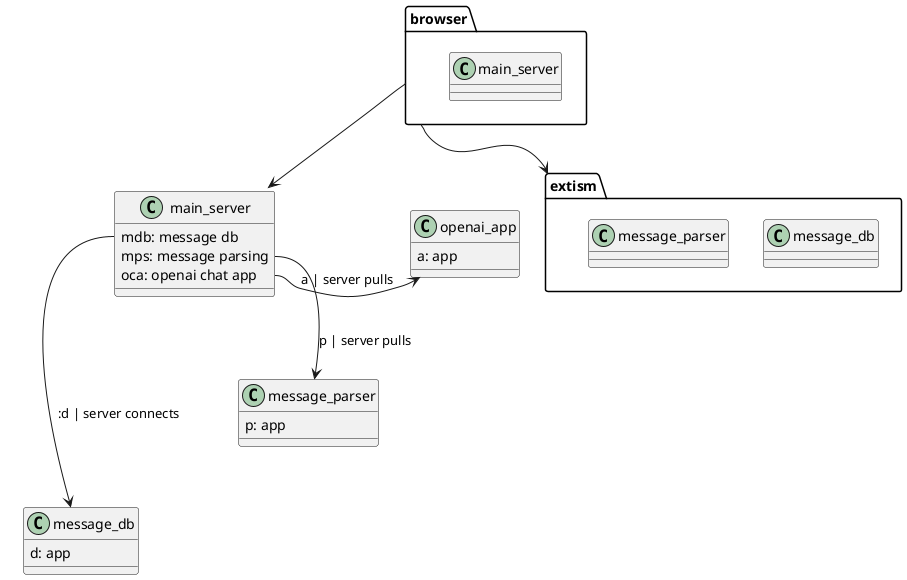
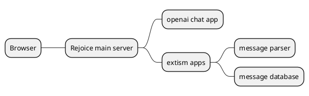
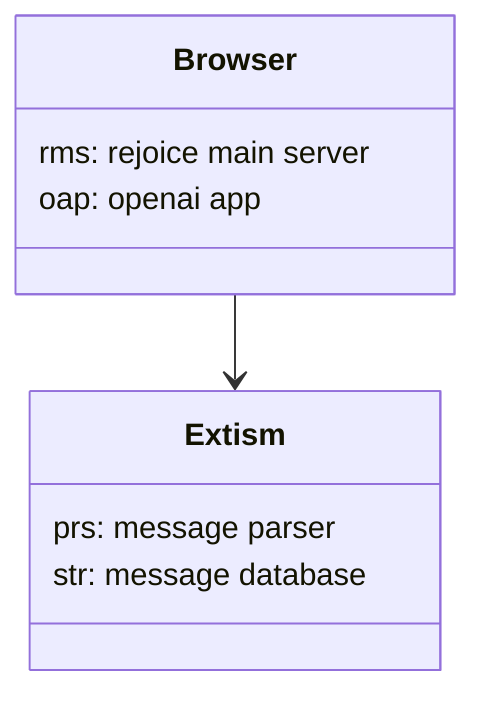
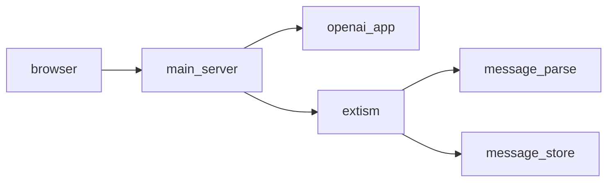

#### Plantuml Diagrams


```plantuml
@startuml
    class main_server{
        mdb: message db
        mps: message parsing
        oca: openai chat app
    }
    class openai_app{
        a: app
    }
    class message_db{
        d: app
    }
    class message_parser{
        p: app
    }

    package browser {
        class main_server
    }
    package extism {
        class message_db
        class message_parser
    }
    main_server::mdb ---> message_db::d | server connects
    main_server::mps --> message_parser:p | server pulls
    main_server::oca -> openai_app:a | server pulls
    browser --> main_server
    browser --> extism 
@enduml
```

Lea


```plantuml
@startmindmap
* Browser
** Rejoice main server
*** openai chat app
*** extism apps
**** message parser
**** message database
@endmindmap
```


```mermaid
classDiagram
    class Browser {
        rms: rejoice main server
        oap: openai app
    }
    class Extism {
        prs: message parser
        str: message database
    }
    Browser --> Extism
```


```mermaid
graph LR
    browser --> main_server
    main_server --> openai_app
    main_server --> extism
    extism --> message_parse
    extism --> message_store
```

```flowchart
st=>start: browser|past
op1=>operation: main server|past

st->op1
```
