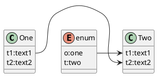
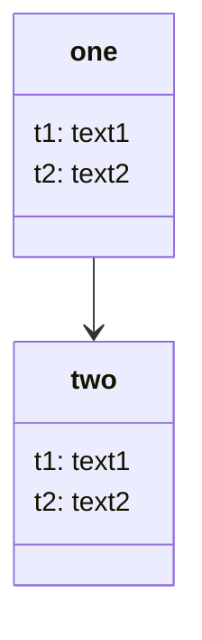
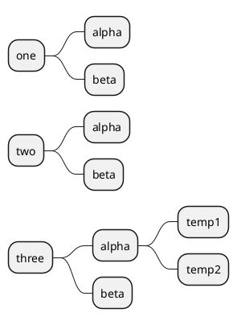
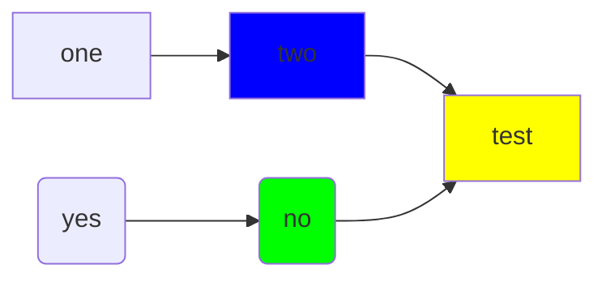
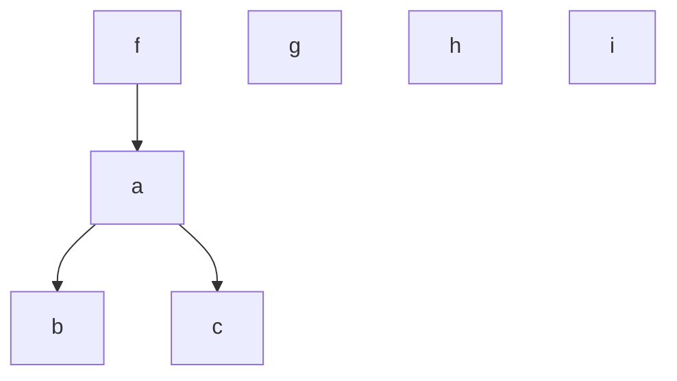

#### Date: 7th Sep


```plantuml
@startuml
    class One{
        t1:text1
        t2:text2
        }
    class Two{
        t1:text1
        t2:text2
        }
    One::t1 -> Two::t2
    Enum enum{
        o:one
        t:two
        }
    enum::o -> Two::t1
@enduml
```


```mermaid
classDiagram
    class one {
        t1: text1
        t2: text2
    }
    class two {
        t1: text1
        t2: text2
    }
    one --> two
```

```flowchart
st=>start: One
c=>condition: Test
op0=>operation: Two
op1=>operation: Three
e=>end: End

st->c
c(yes,left)->op0
c(no)->op1
op1->e
```


```plantuml
@startmindmap
* one
** alpha
** beta
* two
** alpha
** beta
* three
** alpha
*** temp1
*** temp2
** beta
@endmindmap
```


```mermaid
flowchart LR
    A[one] --> B[two]:::blue
    B[two] --> K[one]
    F(yes) --> G[one]:::green
    G(no) --> K[test]:::yellow

    classDef green fill:#00ff00;
    classDef blue fill:#0000ff;
    classDef yellow fill:#ffff00;
```


```mermaid
graph TD
    a --> b
    a --> c
    f --> a
    g
    h
    i
```
