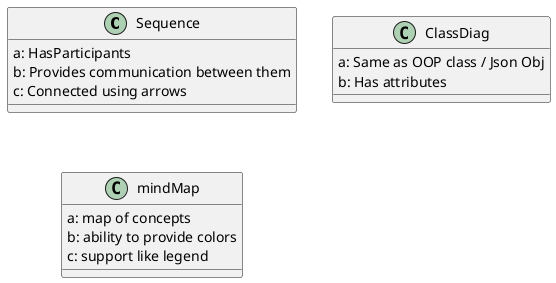
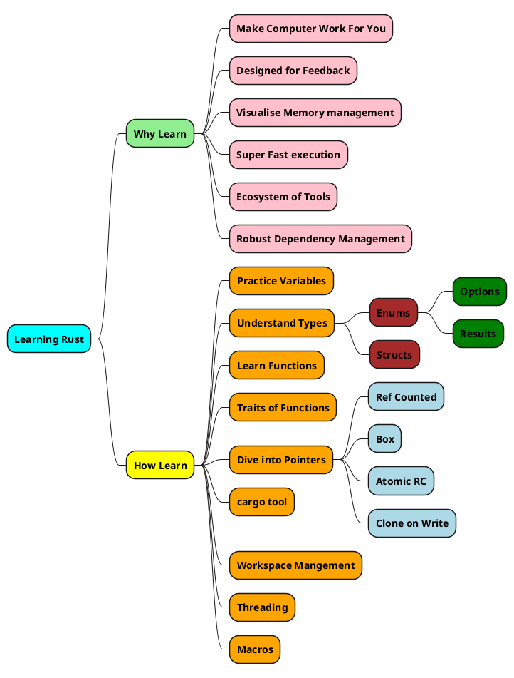
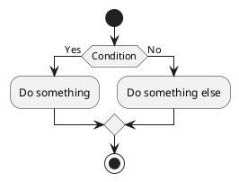
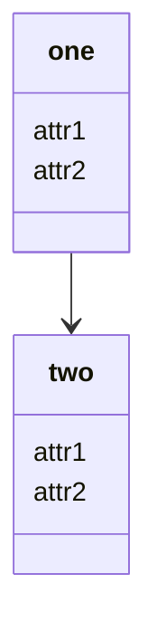
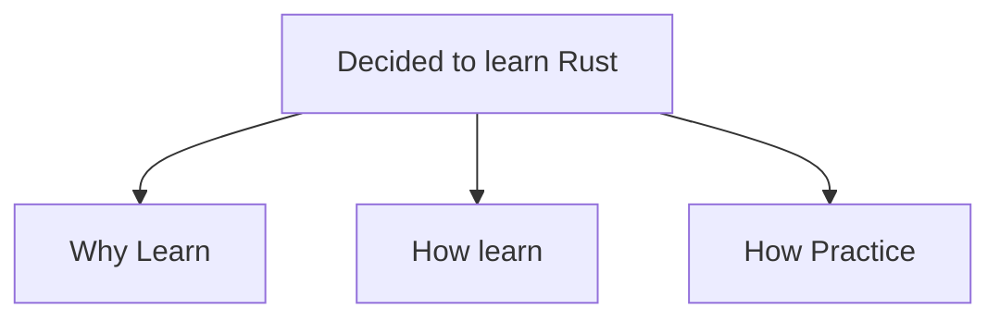
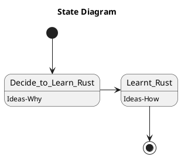

---
Date 12th Sep

Practice Diagramming Based on Teaching Diagramming
---

##### The Main Diagram options in PlantUML



```plantuml
title Sequence Diagram of Making Diagrams
"have thought" -> "Diagram": Choose
"Diagram" -> "Make Diagram": 1st cut
"Make Diagram" -> "Display": Show on
"Display" -> "have thought": Feedback
"have thought" -> "Make Diagram": Update
"Display" -> "have thought": change diagram
```





```flowchart
st=>start: Decided to Learn Rust
op1=>operation: Think why learn Rust
c1=>condition: Found answer
opy=>operation: Figure out How to learn
opn=>operation: Research and make your mind 
c2=>condition: Done
e=>end: Completed Rust Practice-
st->op1
op1->c1(yes)
c1(yes)->opy
c1(no)->opn
opn->c2
c2(no)->opn
c2(yes)->opy
```





@startuml

skin rose

title Simple State Model
[*] --> GlassEmpty
GlassEmpty --> [*]
GlassEmpty : Contents - void

GlassEmpty -> GlassFull
GlassFull : Water
GlassFull --> [*]

note right
this is a note
end note

@enduml



@startuml

skin rose

title Simple Composite State Model
[*] --> NeilDiamond
state NeilDiamond 

state "Neil Diamond" as NeilDiamond {
  state Dancing
  state Singing
  state Smiling
  Dancing --> Singing
  Singing --> Smiling
  Smiling --> Dancing
}

@enduml
