# Planning for Rust Videos

> **Objective of Video**
> 
> Provide the steps to master writing rust code for developing WASM application that can load Neural Network model in Web Browser 

#### Possible Playlist Titles:

> + Mastering Rust and WebAssembly for AI in Web Browsers
> 
> + From Rust to WASM: Deploying AI Models in Web Browsers

Need to have a topic that is attractive and attracts developers to look at the videos

#### Possible 15 Video titles:

```plantuml
skin rose

title Mastrering Rust & WebAssembly for AI in Web Browsers

start 
:Showcase Rust & Wasm in Action;
note left: Load a tokenizer and show the tokenized output
note left: Load a 300MB model and show how the browser performs

:Introducing Rust;
note right:Dive into the important concepts of Rust
```

```plantuml
skin rose

title Mastrering Rust & WebAssembly for AI in Web Browsers


Class "ShowcaseRust&Wasm_in_Action"{
    Load a tokenizer and show the tokenized output
    Load a 300MB model and show how the browser performs
}
Class IntroducingRust{
    Dive into the important concepts of Rust
}
Enum Chooser {
    Right
    Left
}
IntroducingRust --> Chooser
Interface WASM {
    Minutes
}
class BucketList{
    + Make Pizza
    - Try skiing
}
BucketList -> WASM 
WASM --> Chooser


Class Outer {
    step one
    step two
}

Class three{
    Makes Sense
}

Class nextOuter{
    step1
    step2
}

nextOuter::step1 --> Outer : "has a"
nextOuter::step2 --> three : "goes to"
```

```flowchart
st =>start: Mastering Rust & WebAssembly for AI in Web Browsers
op1 =>operation: Showcase Rust & Wasm in Action
pa2 => parallel: Load a tokenizer and show the tokenized output
pa3 =>parallel: Load a 300MB model and show how the browser performs
io =>inputoutput: Introducing Rust
p1 =>parallel: Dive into Rust DataTypes
p2 =>parallel: Learn about 
p3 =>parallel: Dive into Rust variable
p4 =>parallel: Dive into Rust variable

st -> op1
op1 -> pa2
op1 -> pa3
```

```flowchart
st=>start: Start|past
op1=>operation: Step 1 Initialize|past
op2=>operation: Parallel Task A|past
op3=>operation: Parallel Task B|past
c1=>condition: Continue Process?
end=>end: End

st->op1
op1->c1
c1(yes)->op2
c1(no)->end
op2->op3
```

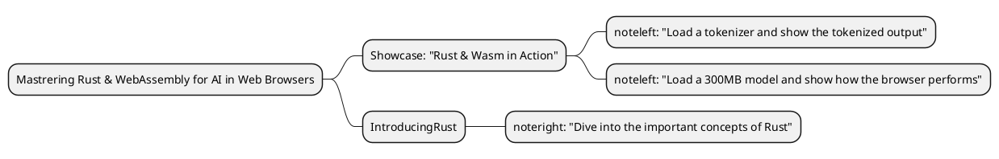

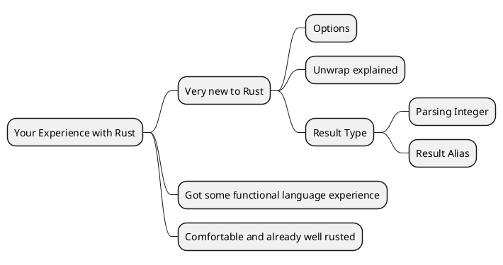

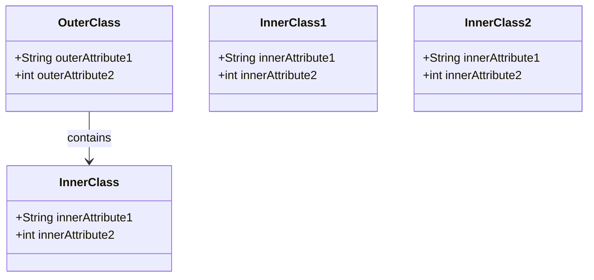

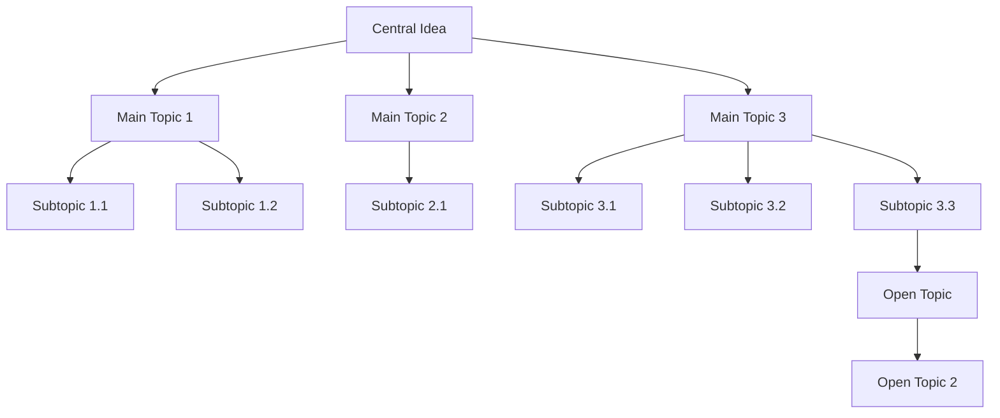

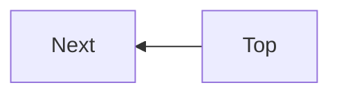

```flowchart
st=>start: Begin
op1=>operation: task1
e=>end: end
st->op1
op1->e
```

##### Practice:1

- Class Diagram

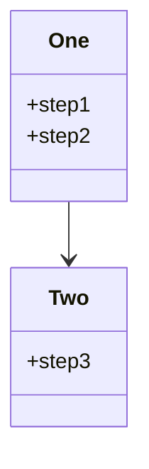

```plantuml
Class One {
    Step 1
    Step 2
}

Class Two {
    Step2
    Step 3
}
Two::Step2 --> One

Class Three {
    task1: Step 2 become detached
    task2: Step3
}
Three::task2 --> One
Three::task1 --> Two
```

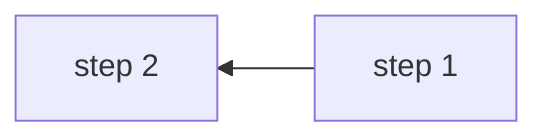

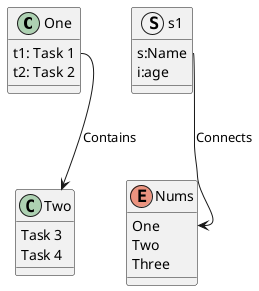

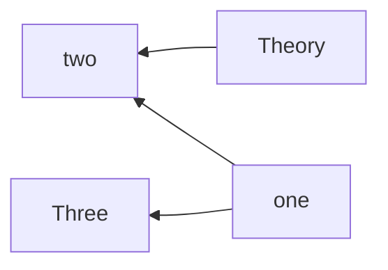

```flowchart
st=>start: what is your knowlege leel?| past
state=>condition: Decide one
new=>operation: New to Rust|current
experienced=>operation: Have experience in functional lang|current
rusty=>operation: Good experienced and 'rusted' well|past

st->state
state(yes)->new
state(no)->experienced
state(yes)->rusty
```

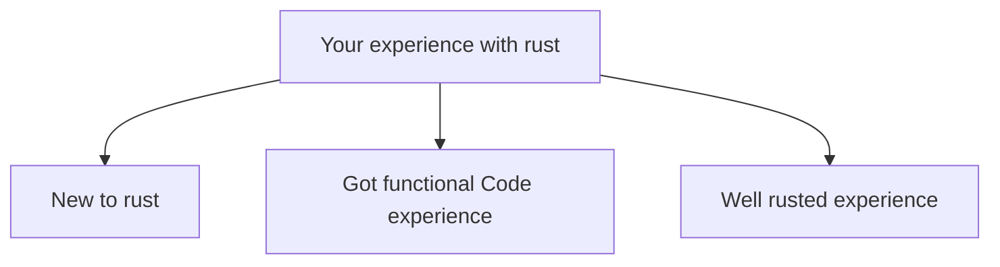

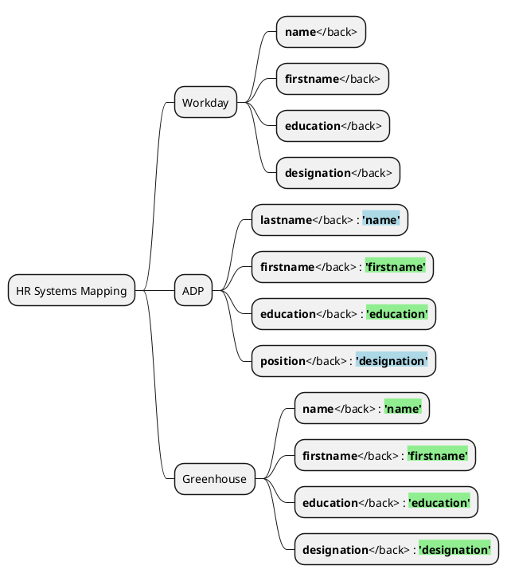

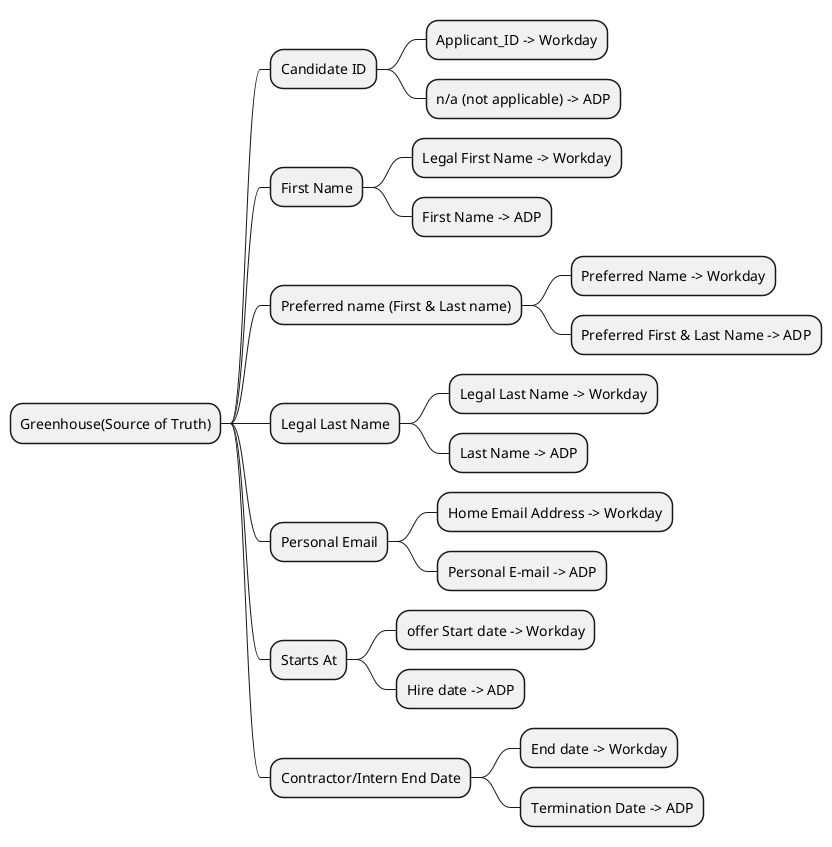

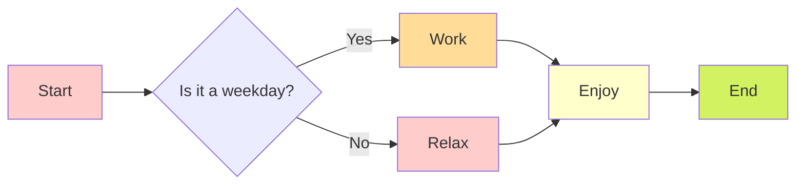

```flowchart
st=>start: Square 1
op=>operation: Square 2
op2=>operation: Square 3
op3=>operation: Square 4
op4=>operation: Square 5

st->op(right)->op2->op3(right)->op4
```

```flowchart
```flowchart
st=>start: Start|past:>[style.fill=#ffccff]
op1=>operation: Operation 1|past:>[style.fill=#ffdd99]
op2=>operation: Operation 2|current:>[style.fill=#ffffcc]
cond=>condition: Condition?|approved:>[style.fill=#d3f261]
e=>end: End|future:>[style.fill=#d0e7ff]

st(right)->op1(right)->cond
cond(yes,right)->op2(right)->e
cond(no,bottom)->e
```

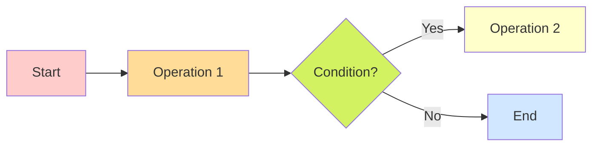

```vega-lite
{
  "data": {
    "values": [
      {"a": "C", "b": 2}, {"a": "C", "b": 7}, {"a": "C", "b": 4},
      {"a": "D", "b": 1}, {"a": "D", "b": 2}, {"a": "D", "b": 6},
      {"a": "E", "b": 8}, {"a": "E", "b": 4}, {"a": "E", "b": 7}
    ]
  },
  "mark": "point",
  "encoding": {
    "x": {"field": "a", "type": "nominal"},
    "y": {"field": "b", "type": "quantitative"}
  }
}
```
