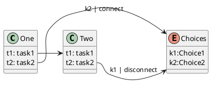
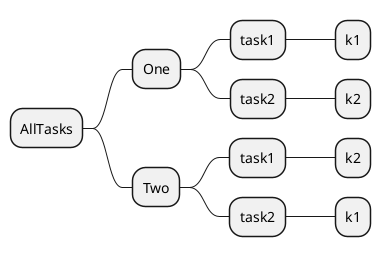
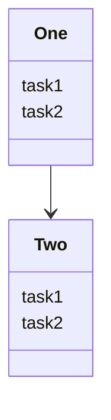
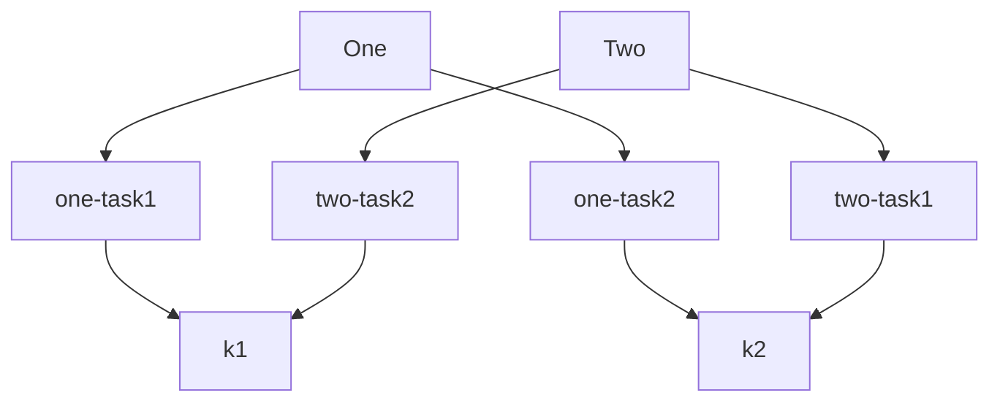

##### Practice Plan:

Class Diagrams on PlantUML



MindMaps on Plantuml



Class Diagrams on Mermaid



FlowChart on Mermaid



Flowchart on Flowchart JS

```flowchart
mst=>start: StartHere| past
mc=>condition: split here| current
st1=>operation: One|past
c1=>condition: which task|past
ot1=>operation: Task1|current
ot2=>operation: Task2|current
st2=>operation: Two|past
c2=>condition: which task|past
oo1=>operation: Task1|current
oo2=>operation: Task2|current
e=>end: End|past
mst->mc
mc(yes)->st1
st1->c1
c1(yes)->ot1
c1(no)->ot2
mc(no)->st2
st2->c2
c2(yes)->oo1
c2(no)->oo2
```
